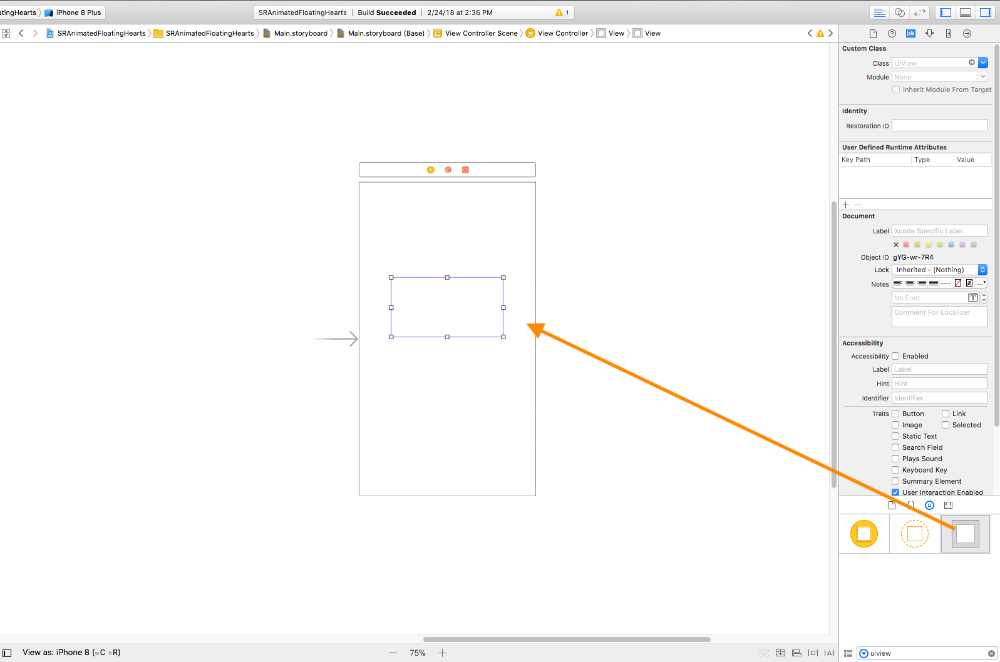

# SRAnimatedFloatingHearts
A floating hearts effect on your like button.

## Demo
<a href="https://imgflip.com/gif/25atv9"></a>

## Usage

**Swift**

1 Add an floatinghearts instance inside a view:

1.1 Drag and drop a UIView instance in Interface Builder.



1.2 Change it's class to favouriteHearts.


1.3 Create a reference of the favouriteHearts.


2 Start/Stop floating heart animation on button touch or on specific function call:

```swift

    func startAnimation() {
        viewHearts.startAnimation()
    }
    func stopAnimation() {
        viewHearts.startAnimation()
    }

```

## Requirements
iOS 11 and later.

